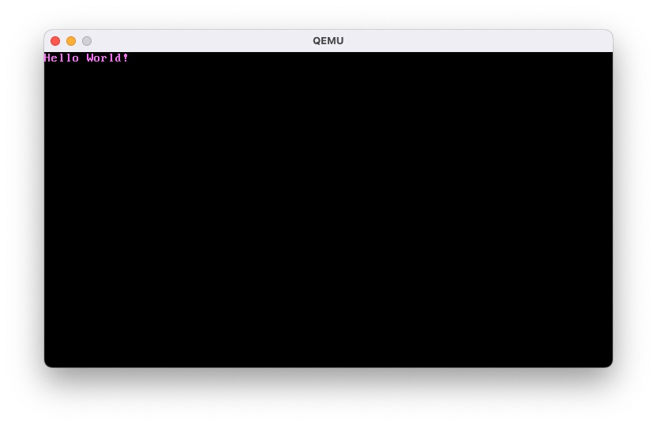

# Build a minimum kernel

## Compile against "the Void"

Since our goal is to build an operation system from scratch which is independent of our hosting system, we have to disable the link to standard library. Then we will not have any access to functions like `println`, and we also have to deal with the following errors:
* error: `#[panic_handler]` function required, but not found
* error: language item required, but not found: `eh_personality`

A json file is introduced to define our own target specification, to make the our program run on bare metal and not rely on any underlying OS.

## Rust Nightly
We use `rustup` to manage multiple rust compilers, including nightly and stable ones. `rustup override add nightly` is used in the project directory.

# Run the minimum kernel
QEMU virtual machine is used for the disk image to run. But first we should create a bootable disk image.

## Creating bootimage

This project will use version 0.9.23 of bootloader crate instead of creating one. The bootimage tool is also used to link the kernel and bootloader to create a bootable disk image:

```bash
cargo install bootimage # Run this in home directory (without the influence of build-std in .cargo/config.toml)
```

```bash
rustup component add llvm-tools-preview
cargo bootimage --target x86_64-rust_os.json
```
This will compile the bootloader crate and may take a while, if it is executed for the first time. Note that the `--target` parameter is required here, even if you have target set in `.cargo/config.toml`. If you messed something up, just run `cargo clean` and recompile.

## Run the bootimage in QEMU

Verify that `target/x86_64-rust_os/debug/bootimage-rust_os.bin` exists, then
```bash
qemu-system-x86_64 -drive format=raw,file=target/x86_64-rust_os/debug/bootimage-rust_os.bin
```
If everything goes is correct, you should see the following window:


We can also edit `.cargo/config.toml` file and set the `runner` config key, then we can just use `cargo run` to start our OS since the next time.

# Rename the Project

At some point we may find that the project name is undesirable. However, renaming a Rust project is not trivial. Some important things to do:
* Edit Cargo.toml
* Rename the folder
* `cd` back to the new
* `rustup override add nightly`
* `rustup component add rust-src`
And after more components are added, the process might be even more complex.
